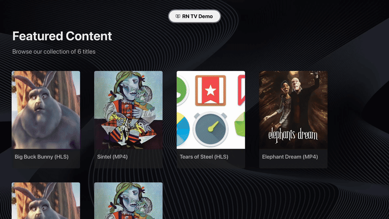

# RN TV Demo 👋



## About

A React Native demo application showcasing an OTT (Over-The-Top) streaming platform for TV and mobile devices. This project demonstrates a complete TV app with catalog browsing, content details, and video playback features.

This is an [Expo](https://expo.dev) project that uses:
- [React Native TV fork](https://github.com/react-native-tvos/react-native-tvos) - supports both phone (Android/iOS) and TV (Android TV/Apple TV) targets
- [React Native TV config plugin](https://github.com/react-native-tvos/config-tv/tree/main/packages/config-tv) - enables Expo prebuild to modify native files for TV builds

## Features

- **Home Screen**: Grid layout with 8 catalog items, D-pad navigation with focus states
- **Details Screen**: Content metadata, description, and play button with TV-optimized focus
- **Player Screen**: Video playback with play/pause controls and error handling
- **Responsive Scaling**: Dynamic sizing that adapts to TV screen dimensions
- **Cross-Platform**: Supports Android TV and Apple TV

## Prerequisites

Before you begin, ensure you have the following installed:
- **Node.js**: Version 20 or higher
- **Yarn**: Package manager
- **Android Studio**: For Android TV development
  - Android SDK API 31 or higher recommended
  - Android TV emulator configured (see setup below)
- **Xcode**: For Apple TV/iOS development (macOS only)

## Setup Steps

### 1. Install Dependencies

```sh
cd rn-tv-demo
yarn
```

### 2. Android TV Emulator Setup

1. Open Android Studio
2. Go to **AVD Manager** (Tools → Device Manager)
3. Click **Create Virtual Device**
4. Select the **TV** category
5. Choose a TV device profile (e.g., "Android TV (1080p)" or "Android TV (4K)")
6. Select a system image (API 31 or higher recommended)
7. Click **Finish** and launch the emulator

Verify the emulator is running:
```sh
adb devices
# Should show your TV emulator listed
```

### 3. Run on Android TV Emulator

```sh
# Generate native files with TV modifications
yarn prebuild:tv

# Build and run on Android TV
yarn android

# Or start the development server separately
yarn start
```

The app will install and launch on your Android TV emulator automatically.

### 4. Alternative: Run on Other Platforms

**Apple TV:**
```sh
yarn prebuild:tv
yarn ios
```

**Mobile (without TV modifications):**
```sh
yarn prebuild
yarn ios      # For iOS mobile
yarn android  # For Android mobile
```

> **Note:** Setting `EXPO_TV=1` enables the `@react-native-tvos/config-tv` plugin to modify the project for TV. This can also be done by setting `isTV` to `true` in `app.json`.

## Libraries Used

### Core Dependencies

| Library | Version | Purpose |
|---------|---------|---------|
| **react-native-tvos** | 0.81-stable | TV-optimized fork of React Native with TV-specific APIs and event handling (`useTVEventHandler`, focus management, D-pad support) |
| **expo** | ^54.0.20 | Expo SDK for cross-platform development, prebuild, and unified tooling |
| **expo-router** | ~6.0.13 | File-based routing with typed routes for type-safe navigation between screens |
| **react-native-video** | ^6.17.0 | Video playback component with play/pause controls, error handling, and streaming support |
| **@react-native-tvos/config-tv** | ^0.1.4 | Config plugin that modifies native files during prebuild for TV-specific assets and configurations |

### Supporting Dependencies

- **expo-font**: Custom font loading
- **expo-splash-screen**: Splash screen management
- **react-native-reanimated**: Smooth animations for focus states
- **react-native-safe-area-context**: Safe area handling across platforms
- **react-native-screens**: Native navigation primitives

### Testing Dependencies

- **jest**: Test framework
- **jest-expo**: Expo-specific Jest preset
- **@testing-library/react-native**: Component testing utilities
- **@testing-library/jest-native**: Additional matchers for React Native

### Why These Libraries?

- **react-native-tvos**: Required for TV platform support; the standard React Native doesn't support TV platforms
- **expo-router**: Provides file-based routing similar to Next.js, making navigation structure intuitive and type-safe
- **react-native-video**: Industry-standard video player with extensive platform support and streaming capabilities
- **@react-native-tvos/config-tv**: Automates TV-specific native file modifications, eliminating manual configuration

## How to Run Tests

This project includes unit tests and integration tests for the OTT functionality.

### Run All Tests

```sh
# Run all tests once
yarn test

# Run tests in watch mode (re-runs on file changes)
yarn test:watch
```

### Test Coverage

The project includes:

1. **Unit Tests** (3 tests)
   - `useCatalog` hook test - validates catalog loading and data structure
   - `CatalogTile` component test - tests rendering and press interactions
   - `useFormatters` hook test - tests time duration formatting

2. **Integration Test** (1 test)
   - Navigation flow test - validates complete Home → Details → Player flow with navigation parameters

### Test Files Location

```
__tests__/
├── hooks/
│   ├── useCatalog.test.ts
│   └── useFormatters.test.ts
├── components/
│   └── CatalogTile.test.tsx
└── integration/
    └── navigation.test.tsx
```

### Manual Testing Checklist

**Home Screen:**
- [ ] Catalog displays 8+ items in grid layout
- [ ] Thumbnails and titles are visible
- [ ] D-pad navigation works between tiles
- [ ] Focus states show border highlight and scale effect
- [ ] Selecting a tile navigates to details screen

**Details Screen:**
- [ ] Poster, title, and description display correctly
- [ ] Play and Back buttons are focusable
- [ ] Play button navigates to player
- [ ] Back button returns to home

**Player Screen:**
- [ ] Video loads and plays automatically
- [ ] Play/Pause button toggles playback
- [ ] Video metadata displayed
- [ ] Loading state shown while buffering
- [ ] Back button returns to details

## TV Development Guide

This section covers key TV-specific features and APIs used in this project.

### TVFocusGuideView

`TVFocusGuideView` is a crucial component for managing D-pad navigation on TV platforms. It helps guide focus movement between UI elements that aren't naturally adjacent in the layout hierarchy.

**When to use:**
- Guiding focus from one section to another (e.g., from sidebar to content grid)
- Creating shortcuts for complex navigation paths
- Preventing focus traps where users can't navigate out of a section

**Important notes:**
- Only available on TV platforms (iOS TV and Android TV)
- Requires refs to target destination components
- Should be conditionally imported using `Platform.isTV`

### useTVEventHandler

Hook for handling TV remote control events like play/pause, menu, and directional buttons.

**Available event types:**
- `focus`, `blur` - Component gains/loses focus
- `select` - Select/Enter button pressed
- `up`, `down`, `left`, `right` - D-pad directions
- `playPause` - Play/Pause button
- `menu` - Menu button

### Focus States on Pressable

All interactive elements should use `Pressable` with focus state styling for proper TV navigation:

**Focus styling best practices:**
- Add visible border or outline when focused (e.g., 3-4px border)
- Use scale transform for emphasis (e.g., `transform: [{ scale: 1.05 }]`)
- Ensure sufficient color contrast (WCAG guidelines)
- Add smooth transitions for better UX

### Responsive Scaling

Use the `useScale()` hook for TV-responsive dimensions:

```tsx
import { useScale } from '@/hooks/useScale';

function MyComponent() {
  const scale = useScale(); // Returns width/1000 on TV, 1 on mobile

  return (
    <View style={{
      padding: 20 * scale,
      margin: 10 * scale
    }}>
      <Text style={{ fontSize: 16 * scale }}>
        Scaled Text
      </Text>
    </View>
  );
}
```

### Resources

- **React Native TV Docs**: [react-native-tvos documentation](https://github.com/react-native-tvos/react-native-tvos)
- **TV Config Plugin**: [@react-native-tvos/config-tv](https://github.com/react-native-tvos/config-tv)

## Known Limitations

### Platform Support
- **Android TV Tabs**: Android TV uses web-based tab layout instead of native tabs due to platform limitations
- **Focus Management**: Focus behavior may vary between Android TV and Apple TV platforms

### Video Playback
- **No DRM**: Demo uses public domain content without DRM support

### Architecture
- **React Native Version**: Locked to 0.81-stable due to react-native-tvos fork compatibility
- **Expo SDK**: May lag behind latest Expo releases due to TV fork dependencies

## TODOs and Future Enhancements

### High Priority
- [ ] **Add Error Boundaries**: Implement error boundaries for graceful error handling
- [ ] **Improve Loading States**: Add skeleton loaders for better perceived performance
- [ ] **Accessibility**: Add proper accessibility labels and ARIA attributes
- [ ] **Custom Header**: Add branded header with logo and navigation for better UI/UX experience

### Internationalization / Localization
- [ ] **Translation Integration**: Replace placeholder text with proper translations via i18n library
- [ ] **Language Switcher**: Add an in-app language selector for users

### Features
- [ ] **Search Functionality**: Add search bar with filtering across catalog
- [ ] **Category Filtering**: Filter content by genre/category
- [ ] **Continue Watching**: Track playback progress and allow resume
- [ ] **Watchlist**: Allow users to save content to watch later
- [ ] **Subtitles Support**: Add closed captions and subtitle support
- [ ] **Multi-Profile Support**: Support for multiple user profiles

### Technical Improvements
- [ ] **Performance Optimization**: Virtualize catalog list for better performance with large datasets
- [ ] **Analytics**: Add analytics tracking for user behavior
- [ ] **User Authentication**: Add login/authentication system
- [ ] **Backend Integration**: Replace mock data with real API integration
- [ ] **CI/CD Pipeline**: Set up automated testing and deployment

## Deployment

This project can be deployed using Expo Application Services (EAS) for all platforms.

**Learn more**: [Expo Hosting Documentation](https://docs.expo.dev/eas/hosting/get-started/)

### TV Build (Android TV / Apple TV)

Build for TV platforms using EAS Build:

```sh
# Configure EAS Build (first time only)
eas build:configure

# Build for Android TV
EXPO_TV=1 eas build --platform android --profile production

# Build for Apple TV (requires Apple Developer account)
EXPO_TV=1 eas build --platform ios --profile production
```

### Distribution

After building, you can:
- **Download APK/IPA**: Get builds from the EAS dashboard
- **Submit to stores**: Use `eas submit` to publish to Google Play Store or Apple App Store
- **Internal testing**: Share build URLs for internal testing

```sh
# Submit to app stores
eas submit --platform android
eas submit --platform ios
```

### Build Profiles

Configure different build profiles in `eas.json` for:
- **Development**: Internal testing builds
- **Preview**: Staging/QA builds
- **Production**: Release builds for app stores

**Learn more**: [EAS Build Documentation](https://docs.expo.dev/build/introduction/)
